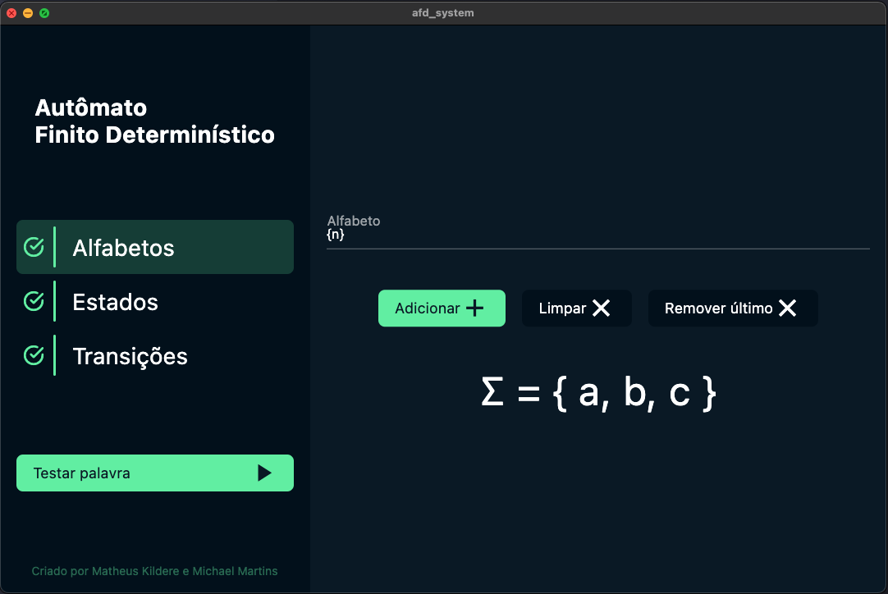
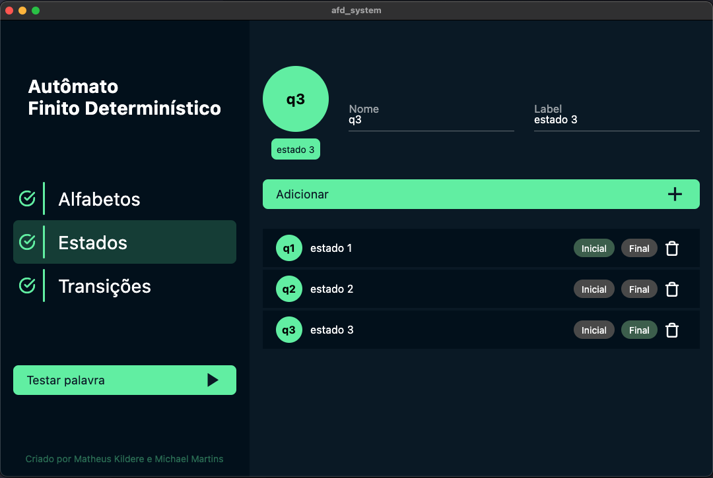
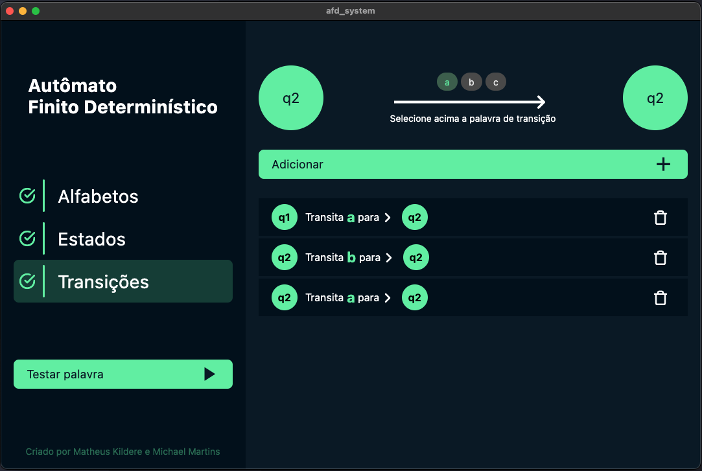
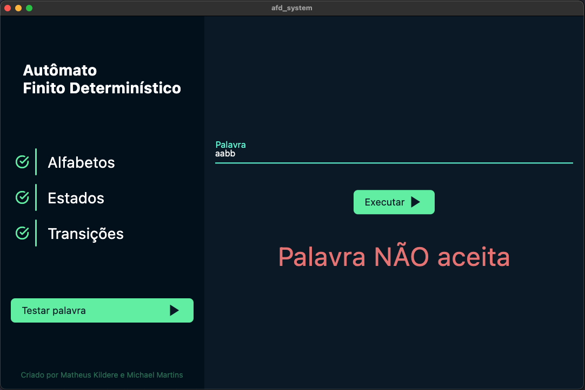

<h1 align="center">
    SIMULADOR DE AUTÔMATO FINITO DETERMINÍSTICO
</h1>

  <a href="#-tecnologia">Tecnologia</a>&nbsp;&nbsp;&nbsp;|&nbsp;&nbsp;&nbsp;
  <a href="#-projeto">Projeto</a>&nbsp;&nbsp;&nbsp;|&nbsp;&nbsp;&nbsp;
  <a href="#-interface">Interface</a>&nbsp;&nbsp;&nbsp;|&nbsp;&nbsp;&nbsp;
  <a href="#-desenvolvimento">Desenvolvimento</a>&nbsp;&nbsp;&nbsp;|&nbsp;&nbsp;&nbsp;
  <a href="#-contribua">Contribua</a>&nbsp;&nbsp;&nbsp;|&nbsp;&nbsp;&nbsp;
  <a href="#memo-license">Licença</a>

  <row>
    
    
    
    
  </row>

 

  <row>
    
    
  </row>
  <row>
    
    
  </row>

## 🚀 Tecnologia

Esse projeto foi desenvolvido com as seguintes tecnologias:

- [Flutter](https://flutter.dev/): Framework para desenvolvimento multiplataforma
- [Dart](https://dart.dev/): Linguagem de programação
- [GetX](https://pub.dev/packages/get): Biblioteca para gerenciamento de estados da aplicação

## 💻 Projeto

Esse projeto foi elaborado para desenvolvimento do trabalho final da disciplina de Linguagens Formais, onde deverá ser criado um simulador de Autômato Finito Determinístico.

## 🔖 Interface

Toda interface foi elaborada e implementada pelos próprios autores deste projeto (@matheuskildere e @michaelmartins09).

## 👷 Desenvolvimento
#### Execute os passos abaixo para iniciar o desenvolvimento local:

_Nota_: Para pular o passo 1 e 2 abaixo, basta fazer o download ZIP desse repositório no botão verde de cima ou aqui nesse [link](https://github.com/michaelmartins09/flutter_desktop_afd_simulator/archive/main.zip)

1. [Clone esse repositório](https://help.github.com/en/articles/cloning-a-repository) com git no terminal do SO com o comando `git clone https://github.com/micaelmartins09/flutter_desktop_afd_simulator.git`.
2. Após o clone do repositório, abra o projeto clonado no **VS Code**.
3. Instale as dependências executando o comando `flutter packages get` ou `flutter pub get` no terminal dentro do seu diretório do projeto (provavelmente `afd_system`).
4. Após o projeto ficar todo carregado, execute o comando `flutter run` ou aperte F5 (modo debug) para executar o app desktop.

## 💻 Compilação

1. Para garantir que não há caches que podem levar a erros, execute antes de tudo um `flutter clean` para fazer a limpeza do projeto.
2. Instale as dependências executando o comando `flutter packages get` ou `flutter pub get` no terminal dentro do seu diretório do projeto (provavelmente `afd_system`).
3. Execute a aplicação com comando `flutter run` ou `F5` do seu teclado.

## 🤔 Contribua

- Faça o FORK do projeto para sua conta;
- Crie uma branch nova para adicionar suas melhorias ou correções: `git checkout -b feature/your_feature_name`;
- Commit suas modificações: `git commit -m 'feat: My new feature'`;
- Faça o Push dos Commits e envio da sua branch: `git push origin feature/your_feature_name`.

Depois do merge, sua PR está pronta e você pode deletar sua branch..

## :memo: License

Esse projeto tem a licença do MIT. Veja em [LICENSE](https://github.com/michaelmartins09/flutter_desktop_afd_simulator/blob/main/LICENSE) para mais detales.

---

Criado com ♥  por Matheus Kildere e Michael Martins
